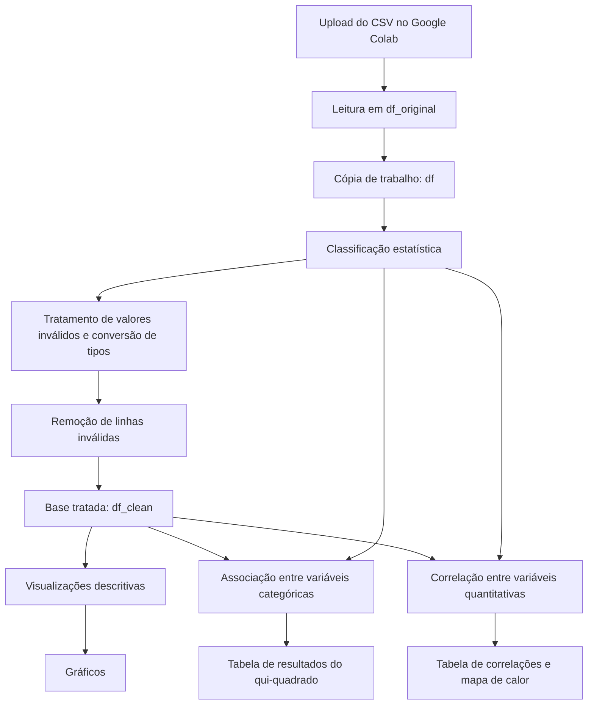

# Análise Exploratória e Estatística da Base Automobile

Projeto desenvolvido como atividade prática do curso **Usando chats inteligentes para análise de dados e machine learning**, da **Ocean** por **Me. Edilson Gabriel Veruz**. Saiba mais: **edilson.veruz@oceanbrasil.com**, com foco na utilização de prompts para apoiar a geração de código Python no Google Colab por meio do Gemini.

O trabalho foi estruturado em etapas de preparação dos dados, visualização, análise de associação entre variáveis categóricas e análise de correlação entre variáveis quantitativas, utilizando a base **Automobile**.

## Objetivos

### Objetivo geral

Explorar a base Automobile por meio de técnicas de preparação, visualização e análise estatística, utilizando Python no Google Colab e prompts.

### Objetivos específicos

- Carregar a base Automobile e preservar uma cópia original dos dados.
- Classificar as variáveis segundo sua natureza estatística, distinguindo variáveis categóricas e quantitativas.
- Identificar e tratar valores inválidos, padronizar os tipos e produzir uma versão limpa da base.
- Visualizar a distribuição de veículos por fabricante e comparar o consumo médio por fabricante.
- Explorar graficamente a relação entre potência, preço e número de portas.
- Investigar associações entre pares de variáveis qualitativas por meio do teste qui-quadrado de independência.
- Calcular e classificar correlações de Pearson entre pares de variáveis quantitativas.
- Organizar tabelas e visualizações que apoiem a interpretação dos dados.

## Tecnologias e ferramentas

| Tecnologia / ferramenta | Finalidade no projeto |
|---|---|
| Python | Linguagem utilizada para as etapas de manipulação e análise dos dados. |
| Google Colab | Ambiente de desenvolvimento e execução dos códigos em notebooks. |
| Gemini | Apoio à geração de códigos a partir de prompts. |
| pandas | Leitura e manipulação de dados tabulares, criação de tabelas e agrupamentos. |
| NumPy | Apoio a operações numéricas, tratamento de valores e comparação de coeficientes. |
| Matplotlib | Construção dos gráficos e do mapa de calor. |
| SciPy (`scipy.stats`) | Aplicação dos testes qui-quadrado e de correlação de Pearson. |
| itertools | Geração de pares únicos de variáveis para as análises estatísticas. |
| `google.colab.files` | Upload do arquivo CSV no ambiente do Google Colab. |

## Dados utilizados

O projeto utiliza a base **Automobile**, disponibilizada ao notebook como arquivo CSV por meio de upload no Google Colab.

### Variáveis consideradas

A classificação estatística especificada nos prompts é:

| Classificação | Variáveis |
|---|---|
| Qualitativa ordinal | `symboling` |
| Qualitativas nominais | `make`, `fuel_type`, `aspiration`, `body_style`, `drive_wheels`, `engine_location`, `engine_type`, `fuel_system` |
| Quantitativas discretas | `num_of_doors`, `num_of_cylinders` |
| Quantitativas contínuas | Demais variáveis numéricas ou que representam medidas na base |

A variável `symboling` é tratada como uma escala ordenada de risco, embora seja representada numericamente. As variáveis `num_of_doors` e `num_of_cylinders` são contagens que podem estar registradas por extenso. Algumas medidas podem ser inicialmente interpretadas como texto devido à presença do caractere `?`.

## Metodologia e etapas do projeto

O fluxo descrito nos prompts está dividido em quatro etapas sequenciais.

### 1. Carregamento, classificação e limpeza

O CSV é carregado por upload no Colab e armazenado em `df_original`. Uma cópia de trabalho, `df`, é utilizada no tratamento, preservando a versão original.

A classificação estatística é definida explicitamente, sem depender exclusivamente dos tipos inferidos pelo pandas. A tabela `tabela_variaveis` foi especificada para reunir o nome da variável, o tipo inicial identificado pelo pandas, a classificação estatística, a quantidade de valores distintos e exemplos de valores.

O tratamento descrito compreende:

- remoção de espaços no início e no final de valores textuais;
- substituição de marcadores como `?`, strings vazias, `NA`, `N/A`, `null`, `None` e valores infinitos por valores ausentes (`NaN`);
- conversão explícita das contagens de portas e cilindros para inteiros;
- conversão das variáveis quantitativas para tipos numéricos, com coerção de valores não conversíveis;
- remoção das linhas que apresentem pelo menos um valor inválido;
- conversão de `symboling` para categoria ordenada, com níveis de `-2` a `3`, e das variáveis nominais para o tipo `category`.

O resultado tratado é armazenado em `df_clean`. O fluxo prevê a apresentação da quantidade de linhas antes e depois da limpeza, da quantidade e do percentual de linhas removidas, das primeiras linhas e dos tipos finais.

### 2. Visualização dos dados

A etapa de visualização prevê três gráficos, construídos com pandas, NumPy e Matplotlib:

1. **Quantidade de veículos por fabricante:** gráfico de colunas com os fabricantes ordenados pela frequência, incluindo os valores sobre as barras.
2. **Consumo médio por fabricante:** gráfico de colunas agrupadas para comparar as médias de `city_mpg` e `highway_mpg`, com ordenação pela média de `city_mpg`.
3. **Potência e preço por número de portas:** gráfico de dispersão com `horsepower` no eixo x, `price` no eixo y e cores distintas para as categorias de `num_of_doors`.

Os prompts especificam o uso do mapa de cores `viridis`, fonte serifada e dimensões definidas em centímetros. Os gráficos são apresentados individualmente.

### 3. Análise de associação entre variáveis categóricas

A análise utiliza as variáveis classificadas como qualitativas nominais ou ordinais na `tabela_variaveis`. Todos os pares distintos são gerados com `itertools.combinations()`.

Para cada par, o fluxo especificado é:

1. construir uma tabela de contingência com `pandas.crosstab()`;
2. aplicar o teste qui-quadrado de independência com `scipy.stats.chi2_contingency()`;
3. registrar a estatística qui-quadrado, os graus de liberdade, o valor-p e a conclusão sobre significância estatística.

O nível de significância definido é **5% (α = 0,05)**. O resultado é organizado no DataFrame `resultados_associacao`, ordenado pelo menor valor-p. Os pares são separados entre aqueles com resultado estatisticamente significativo e aqueles para os quais não foram encontradas evidências estatísticas suficientes de associação nesse nível.

A significância estatística não deve ser interpretada, isoladamente, como medida da intensidade ou da importância prática de uma associação.

### 4. Correlação entre variáveis quantitativas

A etapa seleciona, a partir da classificação estatística, as variáveis quantitativas discretas e contínuas. A variável `symboling` fica excluída, apesar de sua representação numérica, por ter sido classificada como qualitativa ordinal.

É especificado o cálculo da matriz de correlação de Pearson e, para cada par único de variáveis, o cálculo do coeficiente e do valor-p por `scipy.stats.pearsonr()`.

Os coeficientes são classificados conforme os intervalos definidos no projeto:

| Classificação | Critério |
|---|---|
| Perfeitamente negativa | \(r=-1\) |
| Média negativa | \(-1<r<-0,30\) |
| Nula ou muito fraca | \(-0,30\leq r\leq0,30\) |
| Média positiva | \(0,30<r<1\) |
| Perfeitamente positiva | \(r=1\) |

A identificação de coeficientes iguais a -1 ou 1 foi especificada com `numpy.isclose()`. Os resultados são organizados em `resultados_correlacao`, ordenados pelo maior valor absoluto do coeficiente. Também está previsto um mapa de calor da matriz, com Matplotlib, escala de -1 a 1 e os coeficientes anotados nas células.

O nível de significância adotado para os valores-p é **5% (α = 0,05)**. Correlação indica associação linear e, por si só, não demonstra causalidade.

## Fluxo de processamento

## Como executar

As instruções abaixo são orientações de execução:

1. Disponibilize o notebook do projeto no Google Colab.
2. Execute as células na ordem em que foram organizadas: preparação dos dados, visualizações, associação e correlação.
3. Na etapa de carregamento, faça o upload do CSV da base Automobile quando solicitado.
4. Execute as células seguintes mantendo as variáveis produzidas nas etapas anteriores, especialmente `df_clean` e `tabela_variaveis`.
5. Consulte as tabelas e os gráficos gerados ao final de cada etapa.

## Possíveis melhorias futuras

- Avaliar os pressupostos do teste qui-quadrado, especialmente as frequências esperadas.
- Considerar procedimentos para lidar com comparações múltiplas na análise de associação e correlação, documentando seus efeitos.
- Investigar o impacto da exclusão de linhas com valores inválidos e, se adequado ao objetivo, comparar estratégias de tratamento de dados ausentes.
- Adicionar testes ou verificações de consistência para as etapas de preparação, caso o projeto evolua para uma aplicação reutilizável.

## Uso de inteligência artificial no desenvolvimento

Conforme a descrição fornecida, foram elaborados prompts para solicitar ao Gemini a geração de códigos Python destinados ao Google Colab. Os prompts delimitam as atividades, bibliotecas, variáveis, técnicas estatísticas e formatos de saída esperados.

## Referências

- Ocean — curso *Usando chats inteligentes para análise de dados e machine learning*: https://oceanbrasil.com/atividades/5392-Usando-chats-inteligentes-para-analise-de-dados-e-machine-learning
- Google Colab — ambiente indicado para desenvolvimento e execução do projeto: https://colab.research.google.com/
- pandas — documentação oficial: https://pandas.pydata.org/docs/
- NumPy — documentação oficial: https://numpy.org/doc/
- Matplotlib — documentação oficial: https://matplotlib.org/stable/
- SciPy — documentação oficial: https://docs.scipy.org/doc/scipy/
- Gemini — versão 2.5 Flash

